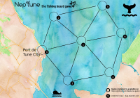

Nep'Tune 
=========
## Contenu du dossier

Ce dossier contient le [plateau de jeu](img/board.png) (en png et en svg) et les [règles du jeux](game_rules.md).

## Histoire

Nep'tune est un jeux de plateau développé durant le séminaire COMMONS du 13 au 18 octobre 2016 qui s'est tenu au [moulin de Richemont](http://www.openstreetmap.org/?mlat=45.7024&mlon=1.3352#map=16/45.7024/1.3352) à Saint-Priest-Ligoure.

L'équipe initiale de développeurs était composée de (par ordre alphabétique) :
* Florian Barès (CRESS Limousin)
* De Rocher Chembessi (Laboratoire GEOLAB UMR 6042 CNRS)
* Etienne Delay (Laboratoire GEOLAB UMR 6042 CNRS)
* Cyril Piou (CIRAD)

## Credit

Icones du logo :
* Neptune by [wikimedia](https://fr.wikipedia.org/wiki/Neptune_%28plan%C3%A8te%29#/media/File:Neptune_symbol.svg)
* Dollar by [Iconnice](http://www.flaticon.com/free-icon/money_131052)
* Money bag by [Freepik](http://www.flaticon.com/free-icon/money-bag-with-dollar-symbol_61584)
* fish by [OCHA](http://www.flaticon.com/free-icon/fish-silhouette_27847)

Icones du plateau :
  * whale tail by [Freepik](http://www.flaticon.com/free-icon/whale_166893)
  * whale by [Freepik](http://www.flaticon.com/free-icon/whale-breathing_85159)
  * anchor by [freepik](http://www.flaticon.com/free-icon/big-anchor_85117)
  * placeholder by [Chanut is Industries](http://www.flaticon.com/free-icon/placeholder_181508)

## TODO
Réunion du 24-09-2016
  * Faire une version en ligne (inspiration dualQuiz)
  * Revoir la génération des poissons. Une case qui a 5 poissons génère un seul poisson. Pour choisir où va ce poisson :
    * la case adjacente qui a le moins de poisson reçois ce poisson,
    * si il y a des cases ex aequo c'est la case qui a le plus petit numéro qui reçois le poisson
  * Reflechir sur qui est le gagnant ? Qu'est ce que ça veux dire gagner ?
  * les joueurs peuvent tenir leur propre comptabilité (poisson péché par tour et poisson vendu)
  * Faire une fiche de résultat globale normalisé, et des fiches joueurs
Idées du 25/10/2016:
 * Le nombre de tours pourrait être ralongé à 20 pour permettre une deuxième phase de jeu avec les bateaux plus puissants/capables (en général, on les achète vers le 10-12eme tour).
 * Proposer que les pions soient des bateaux à faire en pliage en papier (stimulation de départ + personnalisation et marquage en cours de jeu sur le bateau des évolutions (voir même des poissons pêchés?)) (ex.: http://ecole.saint.didier.free.fr/mdc_bateau_papier_fiche.htm)
 * Etablir des règles pour des configurations de joueurs différents: 2 joueurs = 2 bateaux chacun, 3 ou 4 joueurs = 1 bateaux chacun, 5 ou plus = faire plusieurs plateaux
 * Elaborer une histoire pour les règles du jeu (qu'en dis tu?: la ville de Tune City va mettre en place une reserve naturelle... la pêche sera interdite dans 20 mois ... il faudra faire du tourisme...  il faut faire du capital pour pouvoir développer ensuite le tourisme mais ne pas surexploiter la ressource (ou sinon il n'y aura pas de ressource du tourisme))

## License

This work is licensed under a [Creative Commons Attribution-ShareAlike 4.0 International License](https://creativecommons.org/licenses/by-sa/4.0/).
